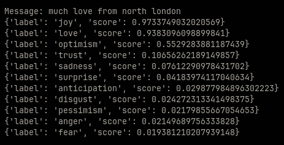
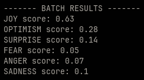

# CaptaFlow (0.9.0)

CaptaFlow is a real-time sentiment analysis application for identifying the dominant emotions in Twitch chat messages to provide audience engagement insights for creators.  

## Architecture Diagram 
I've included an architecture diagram below to show the tools involved and the sequence they're used in. 

## Features

### Sentiment Analysis (with CardiffNLP) 

- The application passes batched Twitch chat messages through a RoBERTa transformer (CardiffNLP) to identify the dominant emotions in each batch.
- Each emotion receives a score from 0 to 1 representing how strongly that emotion is represented in that batch of messages.
- Each batch of emotions is given a datetime timestamp so that the exact moment in the twitch stream when each batch was taken can be pinpointed.
- Streamers can use the detected emotion levels as audience engagement metrics by connected them to the moment in stream when they were recorded. 

## NLP Pipeline Output Previews
These are displayed in terminal as the application runs and is seperate from visualisations as shown in QuickSuite.

### Message Readings 

This console log displays the readings that are taken for each message.
  - Note, TRUST, DISGUST, ANTICIPATION, LOVE and PESSIMISM are not included in the final batch result previews or the final reports, the reason for this is I observed that they didn't provide any additional insight into the
    dominant moods in chat and overlapped too heavily with the other dominant emotions and so they were redundant. 

### Batch Results

 

This console log displays the total sentiment scores for each batch of messages (10 messages per batch by default). 

### Readings Summary 

This console log prints all rows from the dataframe which all batch readings are added to, along with timestamps for when they were taken, and the stream ID the readings belong to. 
